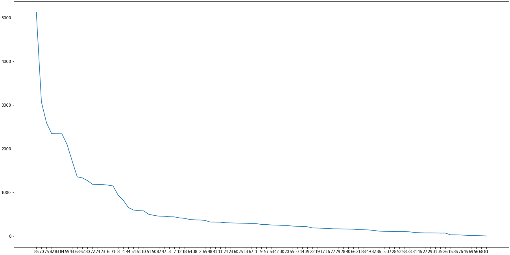
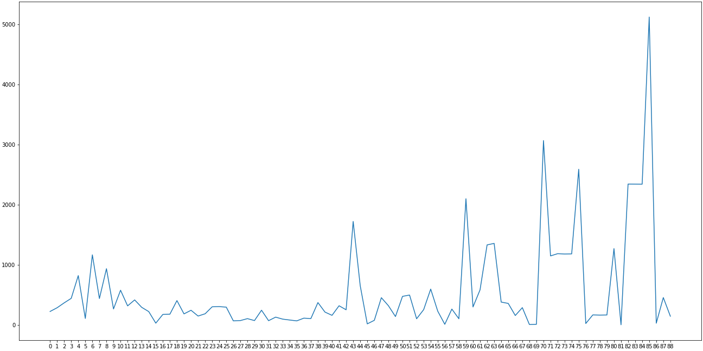
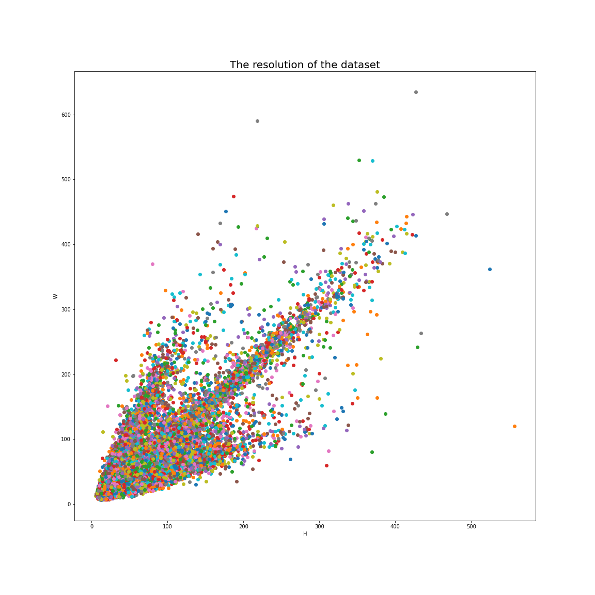
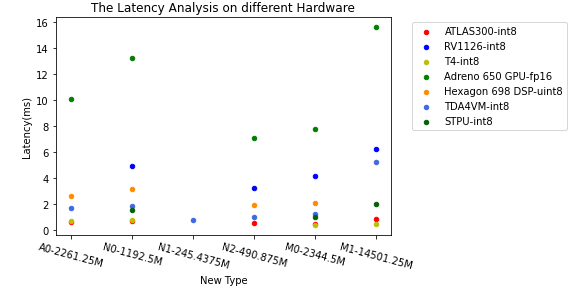

# AAAI-challenge

[TOC]


The content of training for the contest

For the .onnx files are bigger than the upload limit, I upload the files to Beihang Cloud. [Links](https://bhpan.buaa.edu.cn:443/link/B1A7ECE0C3F03ADDED6FF56F3A7A1897)

The structure of training is https://github.com/Fafa-DL/Awesome-Backbones. It's easier compared with the official code of RepVGG, and there are many others classic models for classification.

Now the training codes are all from the official repo, and I create a new repo [here](https://github.com/qhy991/AAAI) to store the modifications I made for training AAAI dataset.

In addition, show the results below
|Model|Type|Accuracy|Weight|onnx|
|-|-|-|-|-|
|RepVGG|A0|88.23%|-|-|
|RepOpt|B1|90.91%|-|-|
|Repopt|A0-(Hyper-serach-AAAI-dataset)|89.42%|-|-|
|Repopt|A0-(Hyper-serach-CF100-dataset)|89.84%|-|-|


## Train Repopt-A0
For the scale file of A0 isn't released, so I train the scale file. Run the code in terminal below:
```sh
python3 -m torch.distributed.launch --nproc_per_node 1 --master_port 12349 main_repopt.py --data-path /data/AAAI/Awesome-Backbones/datasets --arch RepOpt-VGG-A0-hs --batch-size 32 --tag search --opts TRAIN.EPOCHS 240 TRAIN.BASE_LR 0.1 TRAIN.WEIGHT_DECAY 4e-5 TRAIN.WARMUP_EPOCHS 10 MODEL.LABEL_SMOOTHING 0.1 DATA.DATASET imagenet 
```

## Something about the dataset

Through observing the picture number of each class, the long-tailed feature is obvious.





**The statistical data:**

|       | num         |
| ----: | ----------- |
| count | 89.000000   |
|  mean | 561.831461  |
|   std | 809.292792  |
|   min | 8.000000    |
|   25% | 135.000000  |
|   50% | 271.000000  |
|   75% | 502.000000  |
|   max | 5121.000000 |

**The resolution of dataset**

Not only is the number of each class unbalanced, but also the resolution of the pictures vary greatly. As the image below shows: 




The channel of the picture is 3. Among all 50003 pictures, there are 11133 different resolution. Most of them are smaller than 200*200.

## The accuracy of each class

if you want to reproduce the result, you can run 

```sh
python3 -m torch.distributed.launch --nproc_per_node 1 --master_port 12349 main.py --arch RepVGG-A0 --data-path /data/AAAI/datasets --batch-size 32 --tag test --eval --resume /home/qinhaiyan/RepVGG/result/VGG-A0/RepVGG-A0/train_EQLv2/best_ckpt.pth  --opts DATA.DATASET imagenet DATA.IMG_SIZE 112 --out /home/qinhaiyan/RepVGG/result/VGG-A0/RepVGG-A0/train_EQLv2 
```

and then run this code.

### Validation Dataset

This table show the accuracy of each class with ascending trend. The validation number means the number of each class in validation dataset. The sampler ratio is 0.1,  except the class 81, I add all 8 picture as both validation dataset and training dataset.

| Class | Accuracy | validation num |
| ----: | -------: | -------------- |
|    81 | 0.125000 | 8              |
|    83 | 0.418803 | 234            |
|    76 | 0.500000 | 2              |
|    63 | 0.558824 | 136            |
|    74 | 0.559322 | 118            |
|    79 | 0.647059 | 17             |
|    86 | 0.666667 | 3              |
|    73 | 0.686441 | 118            |
|    78 | 0.687500 | 16             |
|    62 | 0.699248 | 133            |
|    27 | 0.714286 | 7              |
|    52 | 0.800000 | 10             |
|    64 | 0.815789 | 38             |
|    84 | 0.833333 | 234            |
|    32 | 0.846154 | 13             |
|    82 | 0.850427 | 234            |
|    65 | 0.888889 | 36             |
|    33 | 0.900000 | 10             |
|     8 | 0.904255 | 94             |
|    39 | 0.904762 | 21             |
|    80 | 0.905512 | 127            |
|    41 | 0.906250 | 32             |
|     7 | 0.909091 | 44             |
|    14 | 0.909091 | 22             |
|     5 | 0.909091 | 11             |
|    70 | 0.911765 | 306            |
|    72 | 0.915254 | 118            |
|    53 | 0.920000 | 25             |
|    75 | 0.922780 | 259            |
|    10 | 0.931034 | 58             |
|    24 | 0.935484 | 31             |
|    66 | 0.937500 | 16             |
|    40 | 0.937500 | 16             |
|    85 | 0.939453 | 512            |
|    19 | 0.944444 | 18             |
|    38 | 0.945946 | 37             |
|    20 | 0.958333 | 24             |
|    61 | 0.965517 | 58             |
|    48 | 0.968750 | 32             |
|    18 | 0.975610 | 41             |
|    12 | 0.976190 | 42             |
|    87 | 0.978261 | 46             |
|    50 | 0.979167 | 48             |
|     6 | 0.982906 | 117            |
|    44 | 0.984615 | 65             |
|     4 | 0.987805 | 82             |
|    43 | 0.988372 | 172            |
|    67 | 1.000000 | 29             |
|    68 | 1.000000 | 1              |
|    69 | 1.000000 | 1              |
|    71 | 1.000000 | 115            |
|    60 | 1.000000 | 30             |
|    58 | 1.000000 | 10             |
|    59 | 1.000000 | 210            |
|    77 | 1.000000 | 17             |
|    57 | 1.000000 | 26             |
|     0 | 1.000000 | 22             |
|    55 | 1.000000 | 23             |
|     1 | 1.000000 | 29             |
|     2 | 1.000000 | 37             |
|     3 | 1.000000 | 44             |
|     9 | 1.000000 | 27             |
|    11 | 1.000000 | 32             |
|    13 | 1.000000 | 29             |
|    15 | 1.000000 | 3              |
|    16 | 1.000000 | 18             |
|    17 | 1.000000 | 18             |
|    21 | 1.000000 | 15             |
|    22 | 1.000000 | 19             |
|    23 | 1.000000 | 30             |
|    25 | 1.000000 | 30             |
|    26 | 1.000000 | 7              |
|    28 | 1.000000 | 11             |
|    29 | 1.000000 | 7              |
|    30 | 1.000000 | 25             |
|    31 | 1.000000 | 7              |
|    34 | 1.000000 | 8              |
|    35 | 1.000000 | 7              |
|    36 | 1.000000 | 11             |
|    37 | 1.000000 | 11             |
|    42 | 1.000000 | 25             |
|    45 | 1.000000 | 2              |
|    46 | 1.000000 | 8              |
|    47 | 1.000000 | 45             |
|    49 | 1.000000 | 14             |
|    51 | 1.000000 | 50             |
|    54 | 1.000000 | 60             |
|    56 | 1.000000 | 1              |
|    88 | 1.000000 | 15             |

### Training Dataset

In addition, I test the model’s training performance in training dataset：

| class | num in training dataset | True | ACC      |
| ----: | ----------------------: | ---: | -------- |
|    81 |                       8 |    1 | 0.125000 |
|    86 |                      31 |    8 | 0.258065 |
|    76 |                      27 |   11 | 0.407407 |
|    83 |                    2111 |  889 | 0.421127 |
|    63 |                    1224 |  691 | 0.564542 |
|    79 |                     154 |   90 | 0.584416 |
|    74 |                    1068 |  625 | 0.585206 |
|    62 |                    1202 |  887 | 0.737937 |
|    52 |                      98 |   73 | 0.744898 |
|    78 |                     153 |  118 | 0.771242 |
|    73 |                    1066 |  833 | 0.781426 |
|    88 |                     135 |  110 | 0.814815 |
|    82 |                    2112 | 1797 | 0.850852 |
|    64 |                     347 |  297 | 0.855908 |
|    84 |                    2110 | 1835 | 0.869668 |
|    65 |                     327 |  287 | 0.877676 |
|    72 |                    1071 |  965 | 0.901027 |
|    45 |                      21 |   19 | 0.904762 |
|    26 |                      66 |   60 | 0.909091 |
|    53 |                     234 |  214 | 0.914530 |
|    68 |                      12 |   11 | 0.916667 |
|    70 |                    2763 | 2595 | 0.939197 |
|    85 |                    4609 | 4342 | 0.942070 |
|    75 |                    2333 | 2200 | 0.942992 |
|    27 |                      71 |   67 | 0.943662 |
|    80 |                    1147 | 1085 | 0.945946 |
|    39 |                     198 |  191 | 0.964646 |
|    22 |                     172 |  166 | 0.965116 |
|    33 |                      92 |   89 | 0.967391 |
|    77 |                     155 |  150 | 0.967742 |
|    15 |                      32 |   31 | 0.968750 |
|    16 |                     162 |  157 | 0.969136 |
|    10 |                     524 |  509 | 0.971374 |
|     8 |                     846 |  823 | 0.972813 |
|    18 |                     369 |  361 | 0.978320 |
|     9 |                     244 |  239 | 0.979508 |
|    48 |                     293 |  287 | 0.979522 |
|    14 |                     205 |  201 | 0.980488 |
|    12 |                     379 |  372 | 0.981530 |
|    17 |                     166 |  163 | 0.981928 |
|    20 |                     225 |  221 | 0.982222 |
|     7 |                     400 |  393 | 0.982500 |
|    35 |                      66 |   65 | 0.984848 |
|     4 |                     743 |  732 | 0.985195 |
|    71 |                    1037 | 1024 | 0.987464 |
|     3 |                     403 |  398 | 0.987593 |
|     1 |                     262 |  259 | 0.988550 |
|     6 |                    1053 | 1041 | 0.988604 |
|    11 |                     290 |  287 | 0.989655 |
|    41 |                     292 |  289 | 0.989726 |
|    61 |                     530 |  525 | 0.990566 |
|    36 |                     107 |  106 | 0.990654 |
|    30 |                     225 |  223 | 0.991111 |
|    57 |                     243 |  241 | 0.991770 |
|    32 |                     122 |  121 | 0.991803 |
|    47 |                     413 |  410 | 0.992736 |
|    24 |                     279 |  277 | 0.992832 |
|    40 |                     149 |  148 | 0.993289 |
|    38 |                     340 |  338 | 0.994118 |
|    43 |                    1553 | 1544 | 0.994205 |
|    54 |                     541 |  538 | 0.994455 |
|    44 |                     593 |  590 | 0.994941 |
|     0 |                     207 |  206 | 0.995169 |
|    87 |                     414 |  412 | 0.995169 |
|    13 |                     269 |  268 | 0.996283 |
|    25 |                     271 |  270 | 0.996310 |
|    23 |                     277 |  276 | 0.996390 |
|     2 |                     335 |  334 | 0.997015 |
|    50 |                     432 |  431 | 0.997685 |
|    51 |                     452 |  451 | 0.997788 |
|     5 |                     102 |  102 | 1.000000 |
|    19 |                     171 |  171 | 1.000000 |
|    21 |                     138 |  138 | 1.000000 |
|    28 |                      99 |   99 | 1.000000 |
|    29 |                      71 |   71 | 1.000000 |
|    31 |                      69 |   69 | 1.000000 |
|    59 |                    1892 | 1892 | 1.000000 |
|    60 |                     274 |  274 | 1.000000 |
|    42 |                     232 |  232 | 1.000000 |
|    46 |                      74 |   74 | 1.000000 |
|    49 |                     131 |  131 | 1.000000 |
|    69 |                      15 |   15 | 1.000000 |
|    67 |                     264 |  264 | 1.000000 |
|    66 |                     146 |  146 | 1.000000 |
|    55 |                     211 |  211 | 1.000000 |
|    56 |                      15 |   15 | 1.000000 |
|    58 |                      98 |   98 | 1.000000 |
|    34 |                      79 |   79 | 1.000000 |
|    37 |                     100 |  100 | 1.000000 |

### EQLv2 Trainnig Dataset 

==Need to update.==

## The analysis of model and performance on different hardware

### Model Analysis

| Type      | num blocks | width multiplier      | Flops    | Params   | Max Memory Cost          |
| --------- | ---------- | --------------------- | -------- | -------- | ------------------------ |
| RepVGG-A0 | [2,4,14,1] | [0.75,0.75,0.75,2.5]  | 202.337M | 7.142M   | 2261.25M(stage4.Conv2d)  |
| RepVGG-N0 | [2,4,14,1] | [1.0,1.0,1.0,1.0]     | 268.466M | 9.784M   | 1192.5M(stage4.Conv2d)   |
| RepVGG-N1 | [2,4,14,1] | [0.25,0.25,0.25,0.25] | 67.117M  | 621.369K | 245.4375M(stage0.Conv2d) |
| RepVGG-N2 | [2,4,14,1] | [0.5,0.5,0.5,0.5]     | 134.233M | 2.459M   | 490.875M(stage0.Conv2d)  |
| RepVGG-N3 | [2,4,14,1] | [0.25,0.25,0.25,0.1]  | 67.540M  | 877.113K | 328.5M(stage4.Conv2d)    |
| RepVGG-N4 | [2,4,14,1] | [0.5,0.5,0.5,1.0]     | 134.515M | 2.777M   | 616.5M(stage4.Conv2d)    |
| RepVGG-M0 | [2,2,2,2]  | [1.0,1.0,1.0,1.0]     | 252.95M  | 4.768M   | 2344.5M(stage4.Conv2d)   |
| RepVGG-M1 | [2,2,2,2]  | [0.75,0.75,0.75,2.5]  | 191.220M | 17.740M  | 14501.25M(stage4.Conv2d) |


> Memory计算策略
>
> 每一次计算需要存储在片上内存的有：
>
> 1. 本层的weight和bias
> 2. 卷积的输出out_conv（int32）
> 3. 卷积输出转换为下一层输入（int8）
>
> relu应该不用存吧？

The detail of computation can be found in [The Memory Cost computation process ](./The Memory Cost computation process.md)

|      | ATLAS300(int8)-Latency(ms) | RV1126(int8)-Latency(ms) | T4(int8)-Latency(ms) | Adreno 650 GPU(fp16)-Latency(ms) | Hexagon 698 DSP(uint8)-Latency(ms) | TDA4VM(int8)-Latency(ms) | STPU(int8)-Latency(ms) | Max Memory Cost |
| ---- | -------------------------- | ------------------------ | -------------------- | -------------------------------- | ---------------------------------- | ------------------------ | ---------------------- | --------------- |
| A0   | 0.641636                   |                          | 0.683414             | 10.06408                         | 2.645636                           | 1.684263                 |                        | 2261.25         |
| N0   | 0.671535                   | 4.930283                 | 0.782737             | 13.22945                         | 3.153485                           | 1.815879                 | 1.50102                | 1192.5          |
| N1   |                            |                          |                      |                                  |                                    | 0.749081                 |                        | 245.4375        |
| N2   | 0.547707                   | 3.260808                 |                      | 7.10899                          | 1.886929                           | 0.988788                 |                        | 490.875         |
| M0   | 0.490182                   | 4.128485                 | 0.393848             | 7.735838                         | 2.07997                            | 1.215657                 | 0.987919               | 2344.5          |
| M1   | 0.846596                   | 6.195939                 | 0.465677             | 15.59577                         | Failure                            | 5.205919                 | 2.016444               | 14501.25        |





